# terminal
針對工廠生產線開發的終端機系統，外接設備包括電子秤、刷卡機、條碼機、印表機，依用途購置連接。軟體各自採用特定工序，專業打造之管理軟體。

> **加入 Facebook 社團**
>
> [https://www.facebook.com/groups/isoface/](https://www.facebook.com/groups/isoface/)
> 
> **點讚追蹤 Facebook 粉絲專頁**
> 
> [https://www.facebook.com/AIOT.ERP](https://www.facebook.com/AIOT.ERP)

## 架構特色

* 使用愛招飛軟體開發工具  Smart 與 PinToo研發設計，服務端連接TARS多用途服務器。
* 採用愛招飛軟體工具 TaskRuner，監管愛招飛終端機相關程序運行狀況。如遇突發狀況，立即發送警訊通知管理人員。自訂處理程序，例如關閉運行程序、重啟..，自動解決繁雜的意外狀況。
* 操作問題，使用愛招飛軟體工具FastDesk，通知管理人員進行遠端桌面遙控，快速解決疑惑。
* 使用愛招飛軟體工具 Flying，協助終端機，使用便捷的網路印表服務。
* 與手機、平板、雲端平臺結合，透過雲端功能將資料自動且即時同步到世界各個角落。
* 愛招飛終端機透過網路，將資料傳送到Android手機或平板上，一鍵操作將資料，包含時間日期、員工、產品名稱上傳至雲端平臺。
* 具備二次開發功能，可自訂或客製化應用程序，以因應企業不同的需求。它除了可連接網路印表機還可選配外接設備，讓您同時保存資料也同時列印，愛招飛終端機，帶來超乎想像的效益。
* 終端機外觀一體成型，美觀大方，可以有效的減少人為拆卸，配備鐳射條碼掃碼儀，直接掃碼條碼，無需手工輸入，減少出錯率。
* 採用觸控式螢幕設計，與智慧手機操作類似，步驟更為簡單，通過簡單的培訓都能熟練。
* 軟體介面簡單清晰，介面顯示字體較大，減少因看不清楚，造成的輸入錯誤。
* 支援語音辨識，輸入文字的同時，用語音播報，覆核輸入結果，減少輸入錯誤。

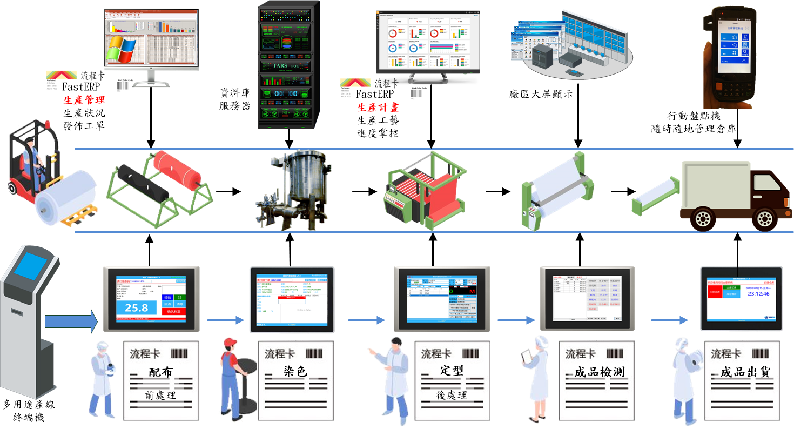

## 終端機通用功能

還在用手寫紀錄資料嗎？

【筆誤】，【看錯】每一天都發生，有這情況，請馬上告別傳統紀錄的方法，採用愛招飛終端機將數據資訊化。提供全自動化流程，提升產業動能。

愛招飛終端機只需輸入代碼或掃描條碼，自動將代碼轉為產品名稱。或者直接在軟體端選擇產品、員工等資訊。完成後螢幕提示成功訊息，此雙向驗證保證效率超乎想像。

愛招飛終端機還具備專屬印表機系統【網路印表系統Flying】，支援自由編輯、資料智慧導入及條碼列印，所有資料均可自動印出。

## 終端機的主要類型

* 刷卡終端機

    即時收集生產相關資訊，達成即時監控與管理的目的。運用現代科技處理以往棘手的問題，再結合愛招飛的印染業ERP管理系統，管理階層可即時而正確地收集工廠生產數據，並進而快速解決問題，同時也降低了在製品的庫存，提高生產效能。

    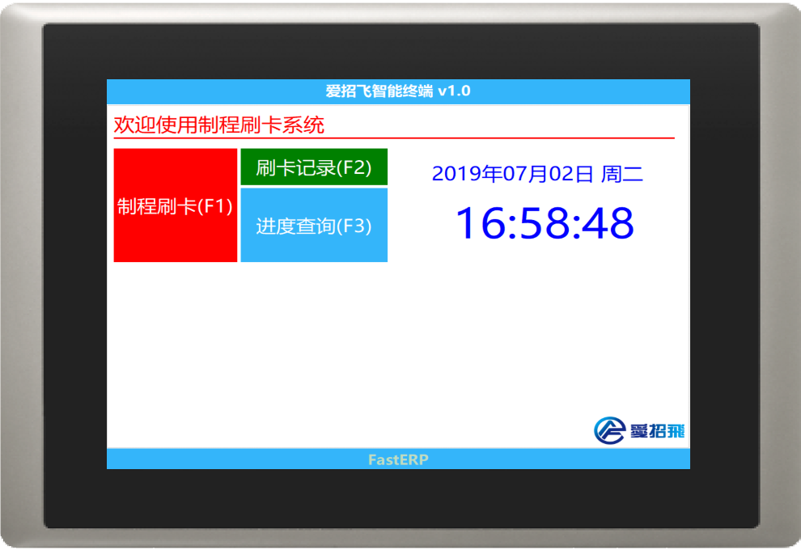
    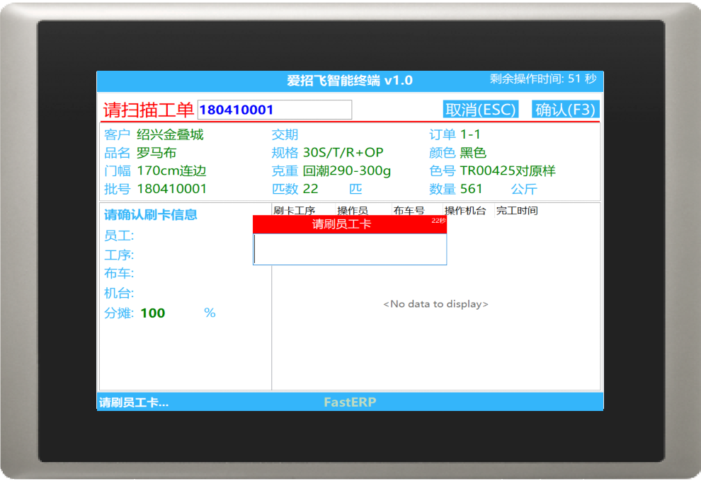

* 驗布終端機

    適用於檢驗包裝之生產工序。它運用感測器緊密連接生產線，整合生產製造過程中所有資料。同時對所採集的資料進行統計分析，形成智慧生產系統，將人力成本降到最低。驗布終端機採用刷卡感應、雷射掃描、觸控式螢幕、自動採集等先進技術。

    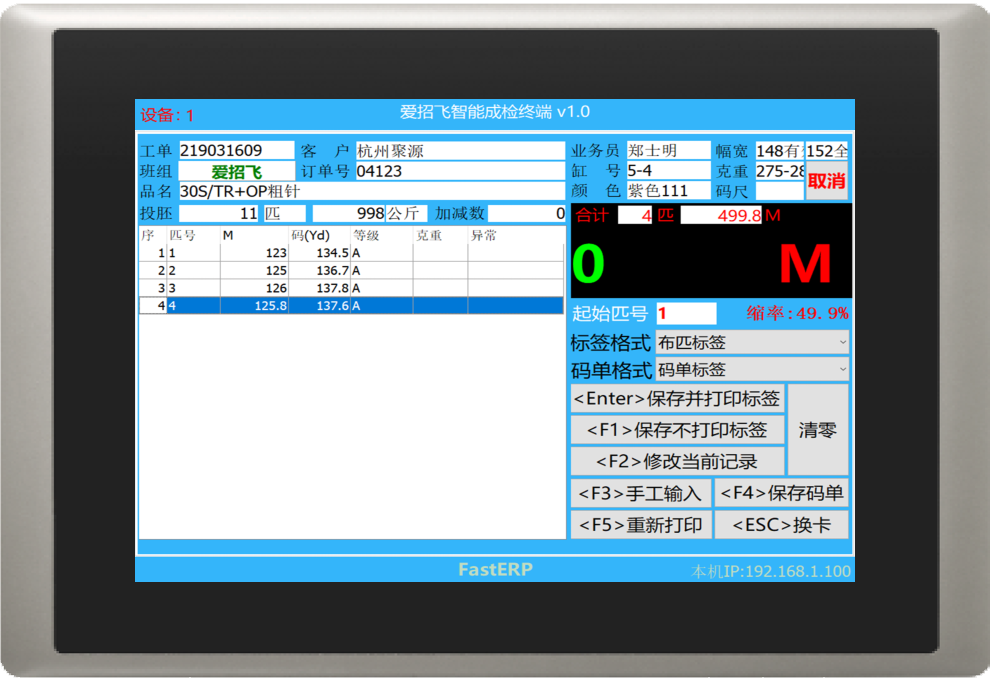
    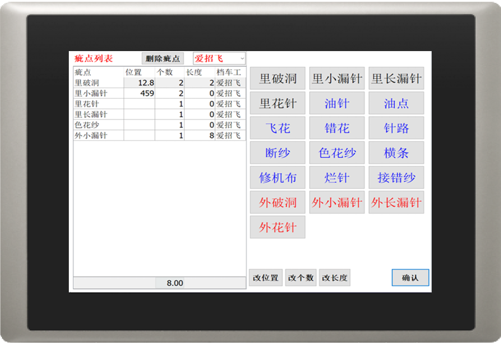

* 落布終端機
    
    通過條碼掃碼儀以及電子秤獲取工單以及重量資訊，擋車工輸入機台、轉數、疵點等資訊。後臺進行資料維護、整理以及統計，提供各類報表作為決策依據。

    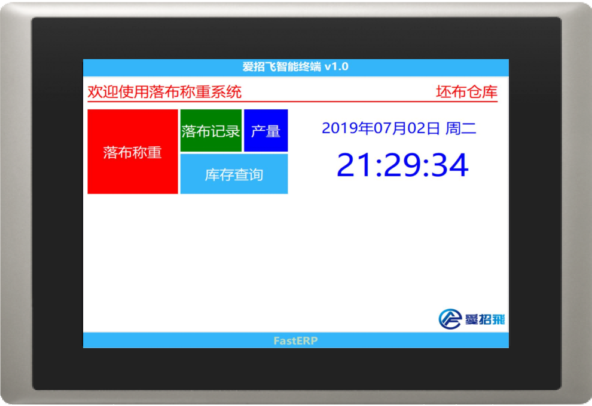
    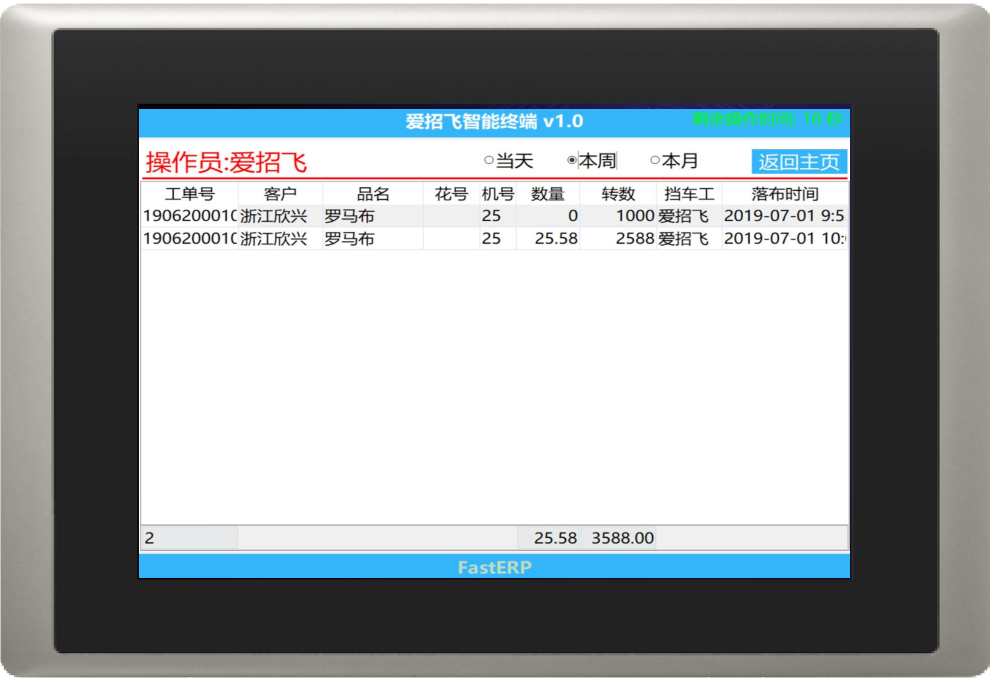

* 出庫終端機

    倉庫管理員利用掃描機掃碼條碼，自助完成出庫作業，輔助工廠生產運作，大幅度提高生產效益，協助企業運用物聯網掌握即時生成進度，實現管理自動化。

    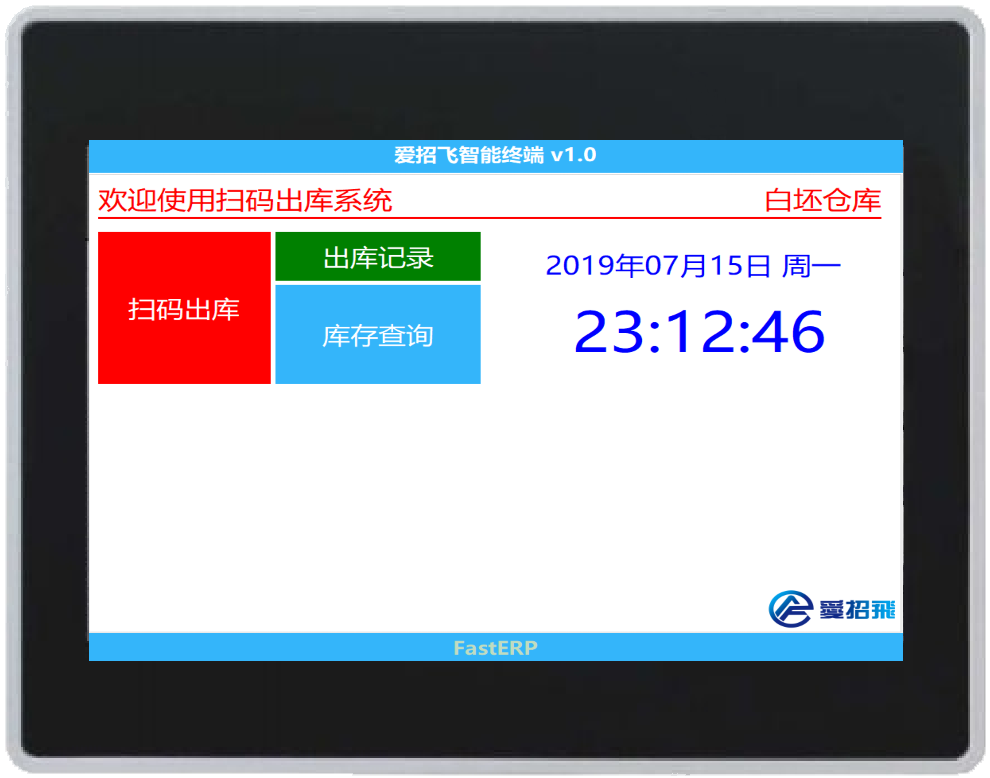
    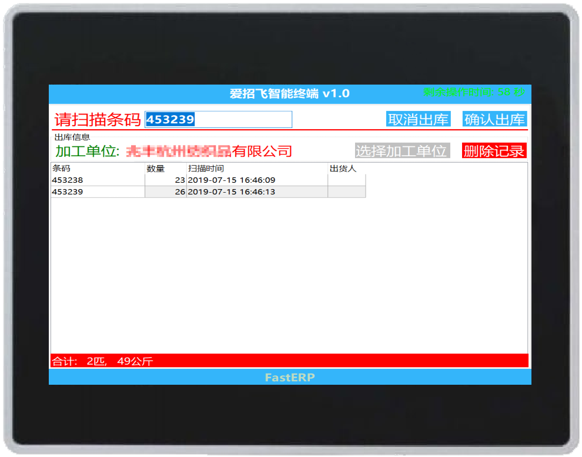

* 領坯終端機

    配布人員在配布完成之後，可以直接在智慧自助領坯終端機進行領坯的動作，電腦端印染管理系統立即提示領坯資訊，減少了倉管員的工作強度，可以間接為工廠節省人力支出。

    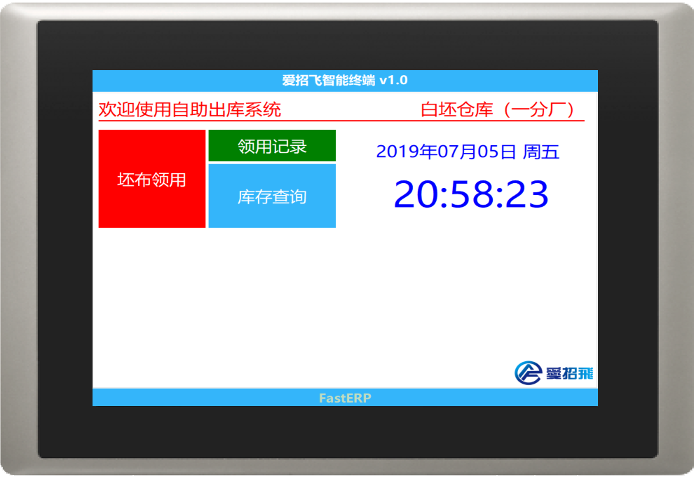
    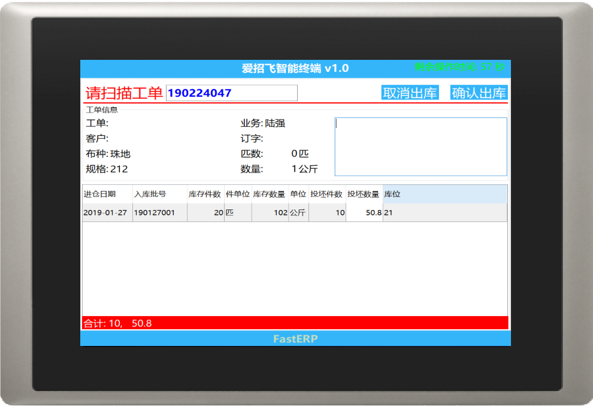

## 硬體規格

採用一體式全封閉解決方案，確保了在織造車間溫度較高、灰塵較多的工作環境下也能正常運行，內嵌 Windows 系統使得軟體系統維護更方便、效率更高。設備外觀設計圖及規格如下：

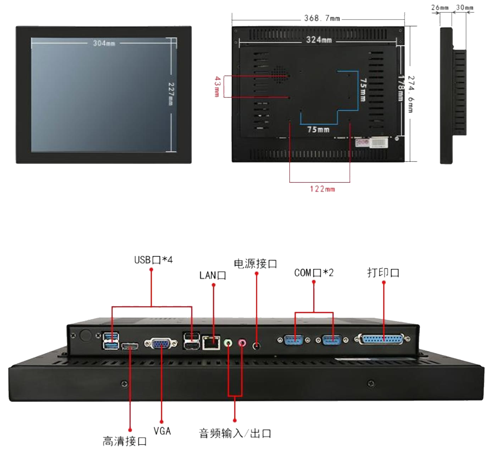

* 外殼採用一體化設計美觀大方，避免了人為隨意拆卸現象。
* 配備鐳射條碼掃描器，可以快速準確識別流轉卡條碼。
* 採用觸控式螢幕操作，前衛時尚，用戶體驗更好。
* 採用 IC/ID 員工卡識別，可以快速準確的確認完工。
* 採用15英寸的觸控式螢幕設計，美觀大方，操作方便，運行更流暢。

## 安裝方式

* 桌面安裝―直接安裝在已有的桌面或者機器設備上，節省成本。
* 壁掛安裝―直接在牆壁上打孔安裝，節省安裝空間，節約成本。
* 嵌入式安裝―需要另外購買主機殼，主機殼選用304不銹鋼材質，讀卡器、鍵盤、主機殼一體成型，
* 選購配備包括儲物櫃和印表機櫃，美觀大方嵌入式安裝可以有效避免靜電干擾。